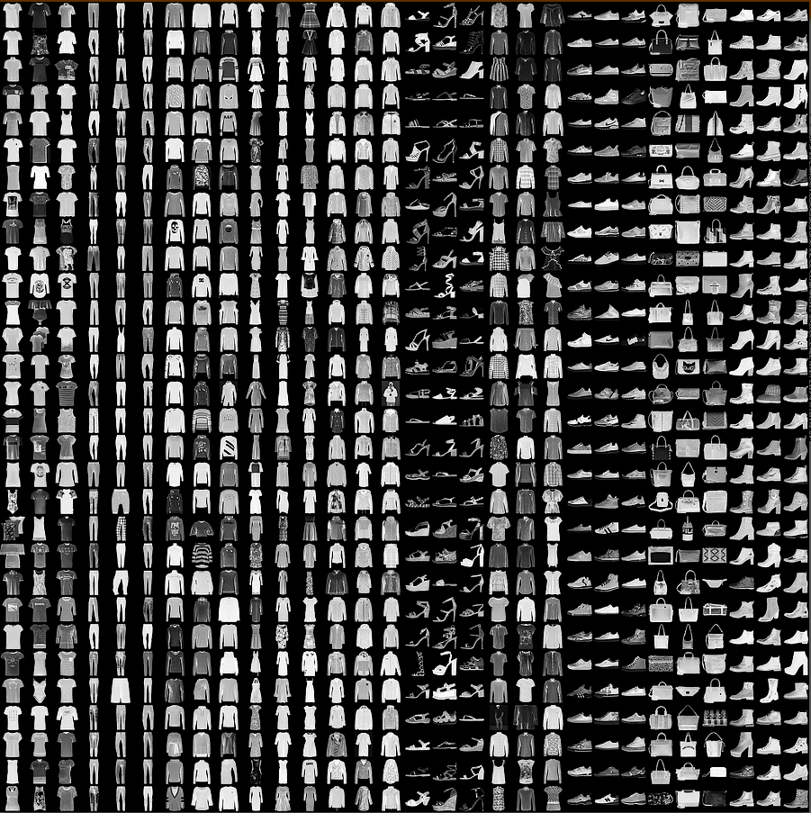

# Bilder Analyse Projekt

Die Idee hinter diesem Projekt ist einen Bilder Stream zu haben, von dem die Bilder und Analysen parallel (auf 2 Threads) und in Echtzeit verlaufen. Zum Schluss müssen die Endresultate berechnet werden und eingereicht werden. 

Hierbei gibt es fünf Hauptbereiche, die behandelt werden:
1. Machine Learning Algorithmus entwickeln
2. Bilder Stream
3. Bilder Verarbeitung
4. Bilder Analyse
5. Endresultate Berechnung

## Machine Learning Algorithmus
Der zu entwickelnde Machine Learning Algorithmus soll auf Bildern 10 verschiedene Arten von Fashion erkennen und anschließend ein Resultat ausgeben. Hierbei wird als Input ein 28x28 grayscale Bild und als Output ein integer definiert. Um die Analyse umzusetzen wird ein Image Classifier mit Hilfe von Pytorch entwickelt.  

## Bilder Stream
Hierbei wird ein Dataset pickle von Bildern genommen, die in binary, uint8 format abgespeichert werden. Zudem wird ein Websocket Stream gebaut, worüber die Bilder mit 10 Bildern pro Sekunde übertragen werden. Die Idee dahinter ist eine Session starten und stoppen zu können, um die Anzahl der übertragenen Bilder auf beiden Seiten kalkulieren zu können und auf beiden Seiten bereit für die Übertragung zu sein. Zudem sollen die Endresultate wieder zurück geschickt werden können.

Somit sind die Entwicklungspunkte die folgenden:
- Dataset mit einer bestimmten Anzahl von Bildern in pickle format erstellen
- Websocket Stream für Bildübertragung erstellen mit Port: 6000
- Websocket Stream für Session Verwaltung, Bildübertragungskalkulation und Resultate Einreichung erstellen mit Port: 7000

## Bilder Verarbeitung
Bei der Verarbeitung der Bilder muss eine Verbindung zum Websocket stream aufgestellt werden, um die Bilder zu erhalten. Anschließend werden diese von binary, uint8 format in ein numpy array verwandelt, die Größe angepasst und in eine Warteschlange geschrieben.

Hierbei sind die Entwicklungspunkte die folgenden:
- Websocket Verbindung erstellen in Form eines listeners
- Konvertieren des Bildes in ein numpy array
- Größe überprüfen und anpassen
- Eine Thread-übergreifende Warteschlange erstellen und das Bild in diese schreiben

## Bilder Analyse
Bei der Analyse der Bilder wird das erste Bild aus der Warteschlange genommen, mittels eines Machine Learning Algorithmus analysiert und das Resultat zusammen mit dem Bild in eine Warteschlange geschrieben.

Hierbei sind die Entwicklungspunkte die folgenden:
- Bild erhalten
- Machine Learning Algorithmus anwenden
- Warteschlange erstellen und Resultate und Bilder in diese schreiben

## Endresultate Berechnung
Beim letzten Schritt wird die Resultate Warteschlange verwendet, um die Endresultate zu berechnen. Zudem werden Übersichtsmetriken erstellt. Außerdem werden 10 Beispiel Bilder ausgewählt mit den jeweiligen Resultaten, die als kleine Überprüfung dienen soll. Zum Schluss wird berechnet, wie viele Bilder erhalten wurden und wie viele der Bilder Stream angibt. Alle Resultate werden in eine Übertragbare Form gebracht und zurück geschickt.

Hierbei sind die Entwicklungspunkte die folgenden:
- Übersichtsmetriken erstellen
- 10 Beispiel Bilder automatisch aussuchen und das Resultat in das Bild schreiben
- Anzahl der Gesamtbilder berechnen und Vergleich mit Bilder Stream aufstellen
- Übertragbare Form erstellen
- Resultate zurück senden

# Grundprinzipien
Zusätzlich zu diesem Projekt gibt es Grundprinzipien, die eingehalten werden.
1. PEP8 überprüft mit pylint
2. Code formating check mit black
3. Static Type überprüft mit mypy
4. unit tests für public functions/classes
5. integration tests zwischen unterschiedlichen Schnittstellen
6. unit tests und integration tests werden in den Ordner tests gegeben und werden wie folgt benannt:
    - unit tests: test_folder_file_function/class_unit.py
    - integration tests: test_folder_file_function/class_integration.py
7. coverage, wie viel vom code ist getestet mit unit tests und integration tests
8. keine print Ausgaben, alles wird über log statements ausgegeben
9. Automatische Überprüfung mittels CI/CD Pipeline

# Beschreibung der Daten
Als Daten werden Bilder in der Größe 28x28 und in grayscale aus dem <a href="https://github.com/zalandoresearch/fashion-mnist">Fashion-MNIST dataset</a> verwendet.

## Labels und Beschreibung
Hier befindet sich eine Tabelle der Labels und Beschreibungen:

| Label | Description |
| --- | --- |
| 0 | T-shirt/top |
| 1 | Trouser |
| 2 | Pullover |
| 3 | Dress |
| 4 | Coat |
| 5 | Sandal |
| 6 | Shirt |
| 7 | Sneaker |
| 8 | Bag |
| 9 | Ankle boot |

## Daten Beispiele
Hier ist ein Beispiel dafür, wie die Daten aussehen (*jede Klasse benötigt drei Zeilen*):

[Bild Quelle](https://raw.githubusercontent.com/zalandoresearch/fashion-mnist/master/doc/img/b6e79fa2.png)

## Datensatz Zitat
Fashion-MNIST: a Novel Image Dataset for Benchmarking Machine Learning Algorithms. Han Xiao, Kashif Rasul, Roland Vollgraf. [arXiv:1708.07747](http://arxiv.org/abs/1708.07747)

## Lizenz für den Datensatz
The MIT License (MIT) Copyright © [2017] Zalando SE, https://tech.zalando.com

Permission is hereby granted, free of charge, to any person obtaining a copy of this software and associated documentation files (the “Software”), to deal in the Software without restriction, including without limitation the rights to use, copy, modify, merge, publish, distribute, sublicense, and/or sell copies of the Software, and to permit persons to whom the Software is furnished to do so, subject to the following conditions:

The above copyright notice and this permission notice shall be included in all copies or substantial portions of the Software.

THE SOFTWARE IS PROVIDED “AS IS”, WITHOUT WARRANTY OF ANY KIND, EXPRESS OR IMPLIED, INCLUDING BUT NOT LIMITED TO THE WARRANTIES OF MERCHANTABILITY, FITNESS FOR A PARTICULAR PURPOSE AND NONINFRINGEMENT. IN NO EVENT SHALL THE AUTHORS OR COPYRIGHT HOLDERS BE LIABLE FOR ANY CLAIM, DAMAGES OR OTHER LIABILITY, WHETHER IN AN ACTION OF CONTRACT, TORT OR OTHERWISE, ARISING FROM, OUT OF OR IN CONNECTION WITH THE SOFTWARE OR THE USE OR OTHER DEALINGS IN THE SOFTWARE.
